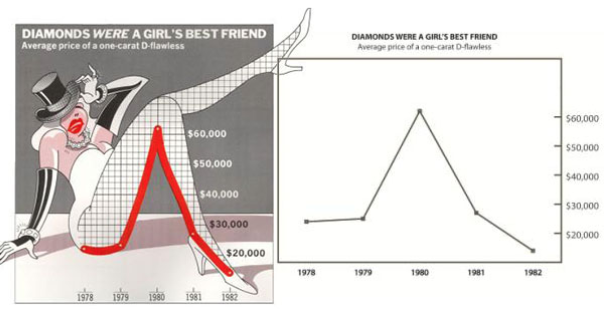
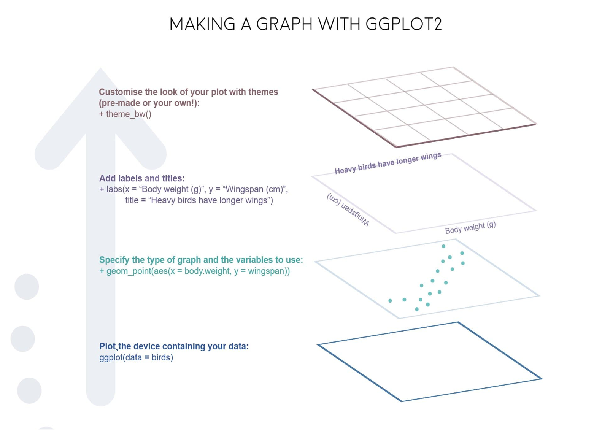
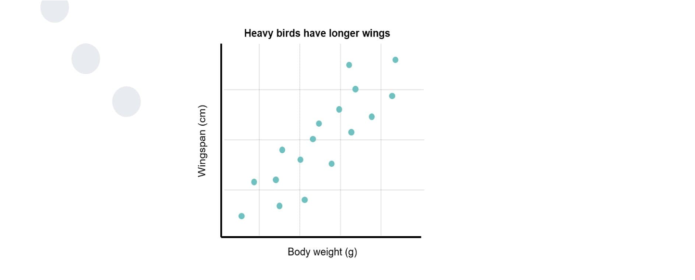

```{r setup, include=FALSE}
knitr::opts_chunk$set(echo = FALSE)
library(tidyverse)
```

## Session Objectives and Transferable Skills

<div style="float: left; width: 50%;">
- To be introduced to the R Universe, in particular the tidyverse and ggplot2
- To understand the benefits of using different plotting methods (*ggplot2* vs *plot*).
- To use business data to generate clear data visualisations. 
</div>
<div style="float: right; width: 50%;">
- Basic introduction to the use of R and the tidyverse
- Basic visualisation techniques using ggplot2
- Understanding data visualisation techniques and good practice. 
- Creative problem solving and debugging 
</div>

## Schedule 

- Introduction (5 minutes)
- Part 1: (40 minutes)
    - Introduction Good Practice for Graph Production
    - Compartive Plotting, *ggplot2* vs *plot*
    - Introduction to Scatter plots in *ggplot2*
- Break (5 minutes)
- Part 2: (35 minutes)
    - Introduction to Bar Charts, Histograms
    - Layering *ggplot2* components (density plots)
    - Saving and Exporting Visualisations
- Review and Conclusion (5 minutes)

## Importance of Data Visualisation in Business 

- Clear, Concise and Accurate communication of key messages 
- Business is data and statistically driven in the age of big data 

# Part 1

## Good Practice for Graph Production

- Current theory is based on principles from Tufte
- These can be summerized as: 
  - Ask how data maps to perception
  - Ask which comparisons you want, guide eye to those
  - Maximize **data-to-ink ratio**
  - Present the most data (without losing interpretability)
  - Remember to use levels of detail and ensure a narrative is included
  
## Bad Practice vs Good Practice

```{r, echo=FALSE, fig.align='center', out.width="800px"}

```

## Bad Practice vs Good Practice 

<div style="float: left; width: 50%;">
- Low Data-to-Ink ratio
- Lots of excess (and pointless) visual information
- Potentially okay for publication in non-scientific based articles 
</div>
<div style="float: right; width: 50%;">
- High Data-to-Ink ratio
- High interpretability and able to draw conclusion from it
</div>

## Grammer of Graphics Example {.smaller}

<font size = "1">
```{r, echo = TRUE, out.height="300px", out.width="500px"}
ggplot() + 
  geom_point(data = diamonds, 
       mapping = aes(x = price, 
                     y = carat, 
                     colour = cut)) + 
  labs(title = "Diamond Price, plotted against Carat", 
       x = "Price",
       y = "Carat")

```
</font>

## ggplot example 

```{r, echo=FALSE, fig.align='center'}

```

## ggplot example 

```{r, echo=FALSE, fig.align='center'}

```

## Comparative Plotting: plot() function

- Ideal for *quick and dirty plotting* 
- Requires: 
  - data = 
  - y ~ x

- Variants include:
  - Bar Plots: *barplot()*
  - Histograms: *hist()*
  
## Scatter Plots {.smaller}

```{r, echo = TRUE, eval = FALSE}

ggplot(data, mapping = aes(x, y)) + 
  geom_point(mapping = aes(alpha, colour, fill, group, shape, size, stroke))

```

<div style="float: left; width: 50%;">
- Core components of a scatter plot in *ggplot*
  - Required Components: 
    - *geom_point()*
    - *x* & *y* variables 

</div>
<div style="float: right; width: 50%;">
  - Optional Components:
    - *alpha*- transparency
    - *colour* - colour of point
    - *fill* - filled colour for points
    - *group* - grouped variables
    - *shape* - shape of points 
    - *size* - point size 
    - *stroke* - border size of points
</div>


# Break 

# Part 2

## Bar Charts {.smaller}

```{r, echo = TRUE, eval = FALSE}

ggplot(data, mapping = aes(x, y)) + 
  geom_bar(mapping = aes(alpha, colour, fill, group, linetype, size))

```

<div style="float: left; width: 50%;">
  - Required Components: 
    - *geom_bar()* / *geom_col()*
    - *x* & *y* variables 
  - Additional Notes:
    - stat = "count" / "bin" / "identity"
    - position = "stack" / "dodge" / "identity"
</div>
<div style="float: right; width: 50%;">
  - Optional Components:
    - *alpha*- transparency
    - *colour* - colour of bars (outer lines)
    - *fill* - filled colour for bars
    - *group* - grouped variables
    - *linetype* - Type of border for bars 
    - *size* - Bar size

</div>

## Histograms {.smaller}

```{r, echo = TRUE, eval = FALSE}

ggplot(data, mapping = aes(x, y)) + 
  geom_histogram(mapping = aes(alpha, colour, fill, group, linetype, size))

```

<div style="float: left; width: 50%;">
  - Required Components: 
    - *geom_histogram()*
    - *x* & *y* variables 
  - Additional Notes:
    - bin / binwidth = number of bins, or width of bins
    - count / ncount = number of points / number of points scaled to 1
    - density / ndensity = density of points in bin, scaled to 1 
</div>
<div style="float: right; width: 50%;">
  - Optional Components:
    - *alpha*- transparency
    - *colour* - colour of bar (outlines)
    - *fill* - filled colour for bars
    - *group* - grouped variables
    - *linetype* - Type of border for bars 
    - *size* - Bar size
  
</div>


## Density Plots {.smaller}

```{r, echo = TRUE, eval = FALSE}

ggplot(data, mapping = aes(x, y)) + 
  geom_density(mapping = aes(alpha, colour, fill, group, linetype, size, weight))

```

<div style="float: left; width: 50%;">
  - Required Components: 
    - *geom_density()*
    - *x* & *y* variables 
    
  - Additional Notes:
    - count = number of points / number of points scaled to 1
    - density / ndensity = density of points in bin, scaled to 1 
    - scaled = density estimate, scaled to 1
</div>
<div style="float: right; width: 50%;">
  - Optional Components:
    - *alpha*- transparency
    - *colour* - colour of density line
    - *fill* - filled colour below the line
    - *group* - grouped variables
    - *linetype* - Type of line 
    - *size* - Line size
    - *weight* - width of the line

</div>


## Saving and Exporting Plots 

```{r, echo = TRUE, eval = FALSE}

ggsave(filename, 
       plot = last_plot())

ggsave(filename, 
       plot = variable.plot)

```

# Hints and Tips 

## Layered Coding {.smaller}

<div style="float: left; width: 45%;">

- geom functions 
  - geom_line() - line chart
  - geom_point() - scatter plot
  - geom_ploygon() - shape diagram
- Aesthetic Descriptors 
  - Fill = - inside/fill colour
  - Colour = - Border colour
  - Alpha = - Transparency Level (0 -> 1)
  - Linetype = - Line Type / Border Type
  - Size = - Border thickness / Point Size
  - Shape = - Point Shape

</div>
<div style="float: right; width: 45%;">

- Themes
  - theme() - base theme
  - theme_bw() - black and white theme
  - theme_void() - empty theme (no scales, legends etc)
- Scales 
  - labs(), xlab(), ylab(), ggtitle() - Labels
  - lims(), xlim(), ylim() - Scale Limits
- Coordinate Systems 
  - coord_cartesian() - Cartesian Coordinate System
  - coord_polar() - Polar Coordinate System

</div>


